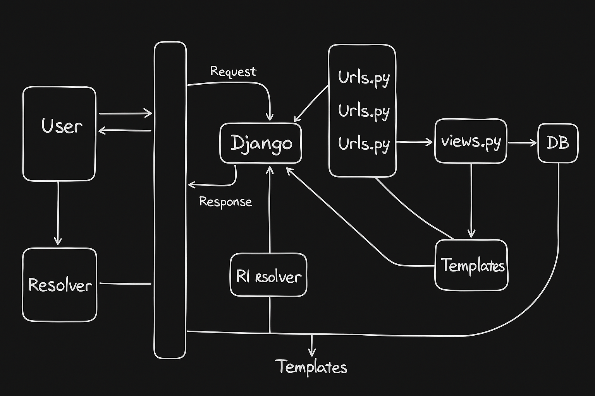

##  [Django Learning](https://docs.chaicode.com/youtube/chai-aur-django/getting-started/)

## Lec-1 : Intro (9:17)

Django is a high-level Python web framework that enables rapid development of secure, scalable web applications. It follows the "batteries included" philosophy, providing built-in solutions for common web development tasks.

Django is popular because it offers an excellent balance of power and simplicity. Its Object-Relational Mapping (ORM) system handles database operations without writing SQL, while its admin interface provides automatic content management. The framework includes robust security features like protection against SQL injection, cross-site scripting, and CSRF attacks by default.

The framework's "don't repeat yourself" (DRY) principle and Model-View-Template (MVT) architecture promote clean, maintainable code. Django's extensive documentation, large community, and rich ecosystem of third-party packages make it accessible for beginners yet powerful enough for complex applications.

Major companies like Instagram, Pinterest, and Mozilla use Django, demonstrating its capability to handle high-traffic applications. Its versatility allows developers to build everything from simple blogs to complex enterprise applications quickly and efficiently.

### Django Version - 5.2.3 

## Lec 2 - Start a Django project and file structure (22:57)

- [Django](https://www.djangoproject.com/) - Django is a high-level Python web framework that encourages rapid development and clean, pragmatic design.

### Creating a Virtual Environment in Python Using `uv`

Here's a step-by-step guide to creating a Python virtual environment using `uv`, the new fast Python package installer and resolver from Astral (makers of Ruff):

### Prerequisites
1. Python 3.7 or higher installed
2. `uv` installed (see installation instructions below if you don't have it)

### Step 1: Install `uv`
If you haven't installed `uv` yet, install it with pip:

```bash
pip install uv
```

### Step 2: Create a Virtual Environment
To create a virtual environment named `.venv` in your project directory:

```bash
uv venv .venv
```

This will create a new virtual environment in a folder called `.venv` in your current directory.

### Step 3: Activate the Virtual Environment

### On Windows (Command Prompt):
```cmd
.venv\Scripts\activate.bat
```

### On Windows (PowerShell):
```powershell
.venv\Scripts\Activate.ps1
```

After activation, your command prompt should show the environment name (e.g., `(.venv)`).

### Step 4: Install Packages (Optional)
With the environment activated, you can install packages using `uv`:

```bash
uv pip install package-name
```

Or install from a requirements file:
```bash
uv pip install -r requirements.txt
```

### Step 5: Deactivate the Environment
When you're done working in the virtual environment:

```bash
deactivate
```

### Additional `uv venv` Options

1. **Specify Python version** (if you have multiple versions installed):
   ```bash
   uv venv --python 3.11 .venv
   ```

2. **Create environment in a different location**:
   ```bash
   uv venv /path/to/venv
   ```

3. **Recreate an existing environment**:
   ```bash
   uv venv --clear .venv
   ```

4. **Create environment with system site packages**:
   ```bash
   uv venv --system .venv
   ```

### Benefits of Using `uv`
- Much faster than traditional `python -m venv`
- Creates environments that are compatible with standard Python tooling
- Comes with `uv pip` which is significantly faster than regular pip

### **1. Setting Up Django**  
- Use `uv` (virtual environment) first, then `pip install django` to install Django.  
- Avoid version conflicts by working inside a virtual environment.  

### **2. Creating a Django Project**  
- After installation, create a project using:  
  ```bash
  django-admin startproject basic_django
  ```
- A standard Django project has an inner folder with the same name (e.g., `basic_django/basic_django/`) containing `manage.py`.  

### **3. Running the Development Server**  
- Navigate to the project folder and run:  
  ```bash
  python manage.py runserver
  ```
- By default, Django runs on `http://localhost:8000`.  
- If port `8000` is busy, specify another port (e.g., `8001`):  
  ```bash
  python manage.py runserver 8001
  ```

### **4. Initial Setup Observations**  
- After running the server, you’ll see a default Django welcome page.  
- Debug mode (`DEBUG = True` in `settings.py`) shows detailed error pages.  
- A SQLite database (`db.sqlite3`) is auto-created for development.  

### **5. Next Steps**  
- Explore project structure (`manage.py`, `settings.py`, `urls.py`).  
- Learn about Django apps (`startapp` command) in future tutorials.  

---  
**Key Terms:**  
- `uv` → Virtual Environment  
- `pip install django` → Install Django  
- `django-admin startproject` → Create a new project  
- `manage.py` → Django management script  
- `runserver` → Start Django dev server  
- `DEBUG = True` → Development error details  
- SQLite → Default Django database.  

#### **1. `manage.py` – The Starting Point**  
- The **entry point** for any Django project.  
- Handles environment variables, server setup, and Django commands (e.g., `runserver`, `migrate`).  
- Used in both **development** and **production**.  

#### **2. Project Structure (`settings.py`, `urls.py`, etc.)**  
- **`settings.py`** → Contains all **configurations** (database, middleware, installed apps, debug mode, etc.).  
  - Easily switch databases (SQLite → PostgreSQL/MySQL) with minimal config changes.  
  - **Debug Mode (`DEBUG = True`)** → Shows detailed error pages (disable in production).  
- **`urls.py`** → Defines **URL routing** (maps URLs to views).  
  - Example: `/admin/` route is auto-configured for Django’s admin panel.  
- **`views.py`** → Contains **business logic** (like a controller in MVC).  
- **`models.py`** → Defines **database schema** (structure of tables/relationships).  

#### **3. Database (SQLite by Default)**  
- Django uses **SQLite** for local development (no setup needed).  
- **Switch databases easily** (PostgreSQL/MySQL) by updating `settings.py`.  
- **No raw SQL needed** → Django’s ORM handles queries.  

#### **4. Apps in Django**  
- A project can have **multiple apps** (e.g., `products`, `checkout`, `coupons`).  
- Each app is **self-contained** (reusable across projects).  
- Created using:  
  ```bash
  python manage.py startapp app_name
  ```

#### **5. Django’s Built-in Features**  
- **Admin Panel** → Auto-generated UI for managing data (`/admin/`).  
- **Authentication** → Ready-to-use user auth (login, logout, permissions).  
- **Middleware** → Security features (CSRF protection, clickjacking defense).  

#### **6. Workflow Overview**  
1. **URL Hit** → `urls.py` routes the request.  
2. **View Processing** → `views.py` handles logic (e.g., fetches data).  
3. **Database Interaction** → `models.py` defines data structure.  
4. **Response** → Returns HTML (or JSON/other formats).  

### Django Project Structure brief

#### Root Level Files

**`db.sqlite3`** - The default SQLite database file that Django creates. This stores all your application data including user accounts, models, and any data you create through Django's ORM.

**`manage.py`** - The command-line utility for Django projects. Used to run the development server (`python manage.py runserver`), create migrations, run tests, create superusers, and execute other Django management commands.

#### Virtual Environment

**`.venv/`** - This is your Python virtual environment folder. It contains an isolated Python installation with all the packages specific to this project, keeping dependencies separate from your system Python installation.

#### Main Project Directory (`basicDjango/`)

This contains the core configuration files for your Django project:

**`__pycache__/`** - Auto-generated folder containing compiled Python bytecode files (.pyc) that Python creates to speed up module loading. Can be safely ignored/deleted.

**`__init__.py`** - An empty file that tells Python to treat this directory as a Python package. Required for Python to recognize the folder as a module.

**`asgi.py`** - ASGI (Asynchronous Server Gateway Interface) configuration. Used for deploying Django with asynchronous capabilities and handling WebSockets, async views, etc.

**`settings.py`** - The most important configuration file. Contains all Django project settings including:
- Database configuration
- Installed apps
- Middleware settings
- Static files configuration
- Security settings
- Time zones and internationalization

**`urls.py`** - The main URL configuration file (URLconf). This is the root URL router that maps URLs to views. It typically includes URL patterns from individual apps.

**`wsgi.py`** - WSGI (Web Server Gateway Interface) configuration file. Used for deploying Django to production servers like Apache or Nginx with WSGI-compatible servers like Gunicorn.

#### Project Structure Significance

This is a standard Django project structure created by `django-admin startproject basicDjango`. The separation between the project folder (basicDjango) and the outer directory allows you to:

1. Keep project configuration separate from individual apps
2. Easily deploy and manage the project
3. Add multiple Django apps within the same project
4. Maintain clean organization as the project grows

The structure follows Django's philosophy of "explicit is better than implicit" and provides a solid foundation for building scalable web applications.

---  
**Key Takeaways:**  
- Django follows **convention over configuration** (predictable structure).  
- **`manage.py`** is the heart of the project.  
- **Apps modularize functionality** (e.g., e-commerce: separate apps for products, cart, etc.).  
- **Database-agnostic** → Change DBs without rewriting code. 

## Lec 3 - Templates and errors in Django (33:00)



---

### **Django Request-Response Flow (Simplified)**
1. **User Request**:  
   - A user sends a request (e.g., login, view a tweet) via a browser.  
   - The request reaches Django’s backend server.

2. **URL Resolver**:  
   - Django’s built-in **URL Resolver** analyzes the request’s URL (e.g., `/login`, `/tweet/123`).  
   - It determines which part of the application should handle the request.  
   - Developers rarely modify this core component.

3. **urls.py**:  
   - The resolver redirects to `urls.py` (URL configuration file).  
   - This file maps URLs to specific **views** (e.g., `/login` → `login_view`).  
   - Modular apps may have multiple `urls.py` files for scalability.

4. **views.py**:  
   - The heart of Django’s logic.  
   - Handles business logic:  
     - Direct responses (e.g., "Welcome to Django").  
     - Database interactions (via `models.py`).  
     - Renders templates (HTML responses).  
   - Processes the request and prepares a response.

5. **models.py** (Optional):  
   - Defines database schema (if data is needed).  
   - Views interact with models to query/save data (e.g., fetch a tweet from DB).

6. **Response**:  
   - The view sends a response (HTML, JSON, etc.) back to Django.  
   - Django forwards it to the user’s browser.  

---

### **Key Points**
- **Simplicity**: Django’s flow involves just 3-4 core components (URL → View → Response), making it fast and reliable.  
- **Modularity**: Apps can have their own `urls.py` and `views.py` for clean separation.  
- **Behind-the-Scenes**:  
  - Python alone can’t handle web requests; Django uses **WSGI** (Web Server Gateway Interface) under the hood.  
  - Events/triggers manage network operations (request/response cycles).  

---

### **Diagram**  
```
User  
  ↓  
Request → Django → URL Resolver → urls.py → views.py → (models.py → DB)  
  ↑                                         ↓  
Response ←──────────────────────────────────┘
```

### Django Application Workflow Explanation

**1. Request Initiation**
- A user makes an HTTP request (GET, POST, PUT, DELETE, etc.) to your Django application through a web browser or client

**2. Django Core Processing**
- Django's core framework receives the incoming request and begins processing it
- The request contains information like URL, HTTP method, headers, and any data

**3. URL Resolution**
- The request is passed to Django's URL resolver
- The resolver examines the request URL and compares it against URL patterns defined in your `urls.py` files
- Django uses a hierarchical URL configuration system, starting from the root `urls.py`

**4. View Function Execution**
- Once a URL pattern matches, Django calls the corresponding view function defined in `views.py`
- The view function receives the request object and any URL parameters

**5. Business Logic & Data Processing**
- The view function contains your application's business logic
- If data is needed, the view interacts with models defined in `models.py`

**6. Database Interaction**
- Models use Django's ORM (Object-Relational Mapping) to interact with the database
- The ORM translates Python code into SQL queries
- Database operations include CREATE, READ, UPDATE, DELETE (CRUD) operations

**7. Data Return**
- The database returns the requested data to the models
- Models process and return this data to the view function

**8. Template Rendering**
- The view function prepares context data (variables to be used in templates)
- Django's template engine renders HTML templates with the provided context
- Templates contain HTML, CSS, JavaScript, and Django template tags

**9. Response Generation**
- The rendered template becomes the HTTP response
- The response travels back through the same path: View → URL Resolver → Django Core

**10. Final Response**
- Django core sends the final HTTP response back to the user
- The user's browser receives and displays the rendered webpage

**Key Django Components:**
- **urls.py**: URL routing and pattern matching
- **views.py**: Business logic and request handling
- **models.py**: Data models and database interaction
- **templates/**: HTML templates for rendering responses
- **Django ORM**: Database abstraction layer

This architecture follows the **Model-View-Template (MVT)** pattern, which is Django's variation of the Model-View-Controller (MVC) pattern. It provides a clean separation of concerns and makes Django applications maintainable and scalable.

### **Why Django?**  
- **Minimalist Flow**: Fewer components → easier debugging.  
- **Built-in Tools**: URL routing, ORM (database), templating.  
- **Scalable**: Modular design supports large projects.  

---

### **Django Request-Response Flow with Views and URLs**
1. **Views (`views.py`)**  
   - The **logic center** of Django.  
   - Handles HTTP requests, processes data (e.g., DB queries via `models.py`), and returns responses.  
   - Example functions:  
     ```python
     from django.http import HttpResponse

     def home(request):
         return HttpResponse("Hello World! You are at Django Home Page")

     def about(request):
         return HttpResponse("This is the About Page")

     def contact(request):
         return HttpResponse("Contact Us Page")
     ```

2. **URL Routing (`urls.py`)**  
   - Maps URLs to specific views.  
   - Uses `path()` to define routes and optional `name` for reverse resolution.  
   - Example:  
     ```python
     from django.urls import path
     from . import views

     urlpatterns = [
         path('', views.home, name='home'),
         path('about/', views.about, name='about'),
         path('contact/', views.contact, name='contact'),
     ]
     ```

3. **Request-Response Cycle**:  
   - **User** → **Request** → **Django** → **URL Resolver** → `urls.py` → `views.py` → **Response** (HTML/JSON).  
   - No direct browser-DB interaction; views mediate all logic.  

4. **Templates (Briefly Mentioned)**:  
   - Used for dynamic HTML rendering (separate from views).  
   - Powerful features like inheritance (e.g., `base.html`).  

---

### **Key Workflow Steps**
1. **User** visits a URL (e.g., `/about`).  
2. **Django’s URL Resolver** checks `urls.py` to route the request.  
3. **View** (`about`) processes the request and returns a response.  
4. **Response** is sent back to the user’s browser.  

---

### **Diagram**
```
User  
  ↓  
Request → Django → URL Resolver → urls.py → views.py → (Optional: models.py → DB)  
  ↑                                         ↓  
Response ←──────────────────────────────────┘
```
Here’s a structured summary of the Django concepts explained in the Hindi transcript:

---

### **Django Templates and Static Files Setup**

#### **1. Directory Structure**
- **Templates Folder**:  
  - Created at the project root (`/templates/`).  
  - Contains HTML files (e.g., `index.html`).  
  - Modular approach: Subfolders like `/templates/website/` for app-specific templates.  

- **Static Folder**:  
  - Created at the project root (`/static/`).  
  - Stores CSS, JS, images (e.g., `style.css`).  

#### **2. Key Files**
- **`index.html` (Template)**:
  ```html
  <!-- Load static files -->
  
  <!DOCTYPE html>
  <html>
  <head>
      <link rel="stylesheet" href="">
  </head>
  <body>
      <h1>Chai aur Django</h1>
  </body>
  </html>
  ```

- **`style.css` (Static File)**:
  ```css
  body {
      background-color: #1a1a2e;
      color: white;
  }
  h1 {
      text-align: center;
      font-size: 2rem;
  }
  ```

#### **3. Configuration in `settings.py`**
- **Templates Setup**:
  ```python
  TEMPLATES = [
      {
          'DIRS': [os.path.join(BASE_DIR, 'templates')],
      },
  ]
  ```

- **Static Files Setup**:
  ```python
  STATIC_URL = '/static/'
  STATICFILES_DIRS = [os.path.join(BASE_DIR, 'static')]
  ```

#### **4. Workflow**
1. **User Request** → Django → `urls.py` → `views.py`.  
2. **View Renders Template**:
   ```python
   from django.shortcuts import render
   def home(request):
       return render(request, 'website/index.html')
   ```
3. **Template Loads Static Files**:  
   - Uses `` to reference static assets.  

#### **5. Common Errors & Fixes**
- **TemplateDoesNotExist**:  
  - Ensure `TEMPLATES['DIRS']` points to the correct path.  
- **Static Files Not Loading**:  
  - Verify `STATICFILES_DIRS` and `` in templates.  
  - Check file permissions and paths (e.g., `/static/style.css`).  

#### **6. Key Concepts**
- **Template Engine**:  
  - Django’s built-in engine allows dynamic content injection (`` tags).  
- **Static Files**:  
  - Served during development via `STATIC_URL`; collected in production using `collectstatic`.  

---

### **Why This Matters**
- **Separation of Concerns**: HTML (templates) vs. logic (views) vs. assets (static).  
- **Modularity**: Reusable templates across apps (e.g., `base.html`).  
- **Performance**: Static files are optimized for production.  

### **Diagram: Request Flow with Templates**
```
User → URL → View → Template (HTML + Static Files) → Rendered Response
```

## Lec 4 - Jinja2 and django apps (32:33)

### What is Template Engine in Django?

Template engines in Django are systems that allow you to separate your application's presentation logic from business logic by generating dynamic HTML content. They enable you to create reusable templates with placeholders for dynamic data, making your web applications more maintainable and following the Model-View-Template (MVT) pattern.

### How Django Template Engines Work?

Template engines process template files containing both static HTML and template syntax (variables, tags, filters) to produce final HTML output. Django's template system uses a context (dictionary of variables) passed from views to render dynamic content within templates.

### Django's Built-in Template Engine (DTL)

Django comes with its own template engine called Django Template Language (DTL), which is the default and most commonly used option. DTL provides:

- **Variables**: `{{ variable_name }}` for outputting dynamic content
- **Tags**: `` for control structures like loops and conditionals
- **Filters**: `{{ variable|filter_name }}` for transforming variable output
- **Template inheritance**: `` and `` for creating reusable layouts
- **Auto-escaping**: Built-in XSS protection by automatically escaping HTML characters

Example DTL template:
```html
<!DOCTYPE html>
<html>
<head>
    <title>{{ page_title }}</title>
</head>
<body>
    <h1>Welcome, {{ user.first_name }}!</h1>
    
        <p>{{ item.name|title }} - ${{ item.price|floatformat:2 }}</p>
    
</body>
</html>
```

### Alternative Template Engines for Production

### 1. Jinja2

Jinja2 is a popular alternative that offers more flexibility and features than DTL:

**Advantages:**
- More powerful and expressive syntax
- Better performance in many scenarios
- Support for macros, advanced inheritance, and more complex expressions
- More Pythonic syntax allowing method calls and complex expressions
- Better integration with JavaScript frameworks

**Configuration in Django:**
```python
TEMPLATES = [
    {
        'BACKEND': 'django.template.backends.jinja2.Jinja2',
        'DIRS': [BASE_DIR / 'jinja2'],
        'APP_DIRS': True,
        'OPTIONS': {
            'environment': 'myapp.jinja2.environment',
        },
    },
]
```

**Use cases:** Applications requiring complex template logic, better performance requirements, or teams familiar with Jinja2 from Flask backgrounds.

### 2. Mako

Mako is a high-performance template engine that compiles templates to Python code:

**Advantages:**
- Excellent performance through compilation
- Full Python expressions in templates
- Powerful inheritance and inclusion features
- Good for applications with heavy template processing

**Limitations:**
- Steeper learning curve
- Less Django-specific documentation and community support
- Requires careful handling of security (no auto-escaping by default)

### 3. Chameleon

Chameleon is XML-based and follows the Template Attribute Language (TAL) specification:

**Advantages:**
- XML-compliant templates
- Good for applications requiring strict XML output
- Template compilation for performance

**Use cases:** Applications with heavy XML processing requirements or teams familiar with Zope/Plone ecosystems.

### Template Engine Selection Factors

**Performance:** Jinja2 and Mako often outperform DTL in rendering speed, especially for complex templates with heavy logic.

**Security:** DTL provides automatic HTML escaping by default, while some alternatives require manual configuration. Always ensure proper XSS protection regardless of the engine chosen.

**Team Expertise:** Consider your team's familiarity with different template syntaxes and ecosystems.

**Integration:** DTL integrates seamlessly with Django's forms, admin interface, and third-party packages. Alternative engines may require additional integration work.

### Common Production Patterns

Many production Django applications use a hybrid approach:
- DTL for admin interfaces and Django-specific components
- Jinja2 for high-performance user-facing templates
- Multiple template engines configured simultaneously for different parts of the application

Most production Django applications stick with DTL due to its tight integration with the Django ecosystem, comprehensive documentation, and security features. Alternative engines are typically chosen when specific performance requirements or template complexity demands exceed DTL's capabilities.

### [Django Documentation](https://docs.djangoproject.com/en/5.2/)

### [Jinja](https://jinja.palletsprojects.com/en/stable/) - Jinja is a fast, expressive, extensible templating engine.

### **1. Django Template Engines**  
- **Jinja2** is the most common template engine (alternative to Django's default DTL).  
- Jinja2 is fast, expressive, and extensible, with a syntax similar to Django Templates but more Pythonic.  
- Features: variables (`{{ }}`), loops, conditionals (``), filters (piping), and comments.  

### **2. Django Project Structure**  
- **Apps** are modular components in Django (e.g., `python manage.py startapp myapp` creates an app named `myapp`).  
- After creating an app, **register it** in `settings.py` under `INSTALLED_APPS`.  

### **3. Template Handling**  
- Templates can be stored:  
  - Inside the app (`app_name/templates/app_name/`).  
  - Globally in the project’s `templates/` folder.  
- **VS Code Setup**: Enable Jinja/Django syntax highlighting by adding `"emmet.includeLanguages": {"django": "html"}` in settings.  

### **4. Key Files in a Django App**  
- `models.py` (Database models)  
- `views.py` (Handles HTTP requests/responses)  
- `urls.py` (Routes URLs to views)  
- `admin.py` (Admin panel configurations)  

### **5. Basic Syntax**  
- **Variables**: `{{ variable }}`  
- **Tags (logic)**: `` (e.g., `` loops, `` conditionals).  
- **Static Files**: Use `` to include CSS/JS.  

### **6. Workflow**  
1. Create an app (`startapp`).  
2. Register it in `settings.py`.  
3. Define **URLs** (in app’s `urls.py`).  
4. Create **views** to render templates.  
5. Use **templates** with Jinja2/DTL syntax.  

### After creating a new Django app (e.g., python manage.py startapp 'myapp'), you must register it in the main project’s settings.py file.

### **Step 1: Registering a Django App**  
After creating a new Django app (e.g., `python manage.py startapp chai`), you must **register it** in the main project’s `settings.py` file.  

#### **Why?**  
- Django needs to **recognize** the new app for features like models, admin, templates, and migrations.  
- Unregistered apps **won’t work** (e.g., templates won’t load, models won’t migrate).  

#### **How?**  
1. Open `settings.py` in your project folder.  
2. Find `INSTALLED_APPS`.  
3. Add your app’s name (e.g., `'chai'`) to the list:  
   ```python
   INSTALLED_APPS = [
       ...,
       'chai',  # Add your app name here
   ]
   ```  
4. **Save** the file.  

#### **Key Points**  
- Always **add a comma** after each app (for clean syntax).  
- Third-party apps (like `'admin'`, `'auth'`) are pre-registered—your custom apps.

#### **1. URL Routing in Django**  
- **Main `urls.py` (Project Level)**: Controls the **global URL routing** of the project.  
- **App `urls.py` (App Level)**: Handles **app-specific URLs** (modular approach).  

#### **2. Transferring Control from Project to App**  
- Use **`include()`** in the **main `urls.py`** to delegate URL routing to an app:  
  ```python
  from django.urls import path, include
  
  urlpatterns = [
      path('myapp/', include('myapp.urls')),  # Routes all `/myapp/` requests to the app
  ]
  ```  
- **Why?**  
  - Keeps URLs **organized** (avoids a messy main `urls.py`).  
  - Follows **Django’s "app-based modularity"** principle.  

#### **3. Defining URLs Inside an App**  
- Create a **`urls.py`** inside the app (e.g., `myapp/urls.py`).  
- Define app-specific paths:  
  ```python
  from django.urls import path
  from . import views
  
  urlpatterns = [
      path('', views.all_chai, name="all-chai"),  # Handles `/chai/`
      path('order/', views.order, name="order"),  # Handles `/chai/order/`
  ]
  ```  
- **Key Points**:  
  - **`path('')`** → Handles the **base URL** (`/myapp/`).  
  - **`name=`** → Used for **reverse URL lookup** (best practice).  

#### **4. How Django Processes URLs**  
1. Request hits **`/myapp/`** → Main `urls.py` **delegates** to `myapp.urls`.  
2. `myapp/urls.py` **matches the path** (e.g., `''` → `views.all_chai`).  
3. **View function** (`all_chai`) processes the request and returns a response.  

#### **5. Best Practices**  
- **Modularity**: Each app manages its own URLs.  
- **`include()`**: Essential for **scaling** (avoids a monolithic `urls.py`).  
- **Named URLs**: Use `name=` for dynamic links (e.g., `` in templates).  

### **Visual Flow**  
```
User Request → Project urls.py → include() → App urls.py → View → Template
```
This keeps code **clean, maintainable, and scalable**. 🚀  

#### **1. Template Inheritance in Django**  
- **Purpose**: Avoid repetitive HTML code (e.g., navbar, footer) by creating a **base template** (`layout.html`).  
- **Syntax**:  
  ```html
  <!-- layout.html (Base Template) -->
  Default Title  
  
  ```
  ```html
  <!-- child_template.html -->
  
  Home Page
  Chai Page Content
  ```

#### **2. Key Concepts**  
- **``**: Inherits from a parent template (e.g., `layout.html`).  
- **``**: Defines sections that child templates can override.  
- **``**: Loads static files (CSS/JS) in templates.  

#### **3. Workflow**  
1. **Create `layout.html`** with common elements (navbar, footer) and `` placeholders.  
2. **Child templates** (e.g., `home.html`, `all_chai.html`) extend `layout.html` and override blocks.  
3. **Django searches templates** in:  
   - App-specific `templates/app_name/` folder.  
   - Project-wide `templates/` folder (defined in `settings.py`).  

#### **4. Dynamic URLs with ``**  
- **Best Practice**: Use named URLs in `urls.py` for dynamic linking:  
  ```python
  # urls.py
  path('myapp/', views.all_chai, name="chai-page"),
  ```
  ```html
  <!-- template.html -->
  <a href="">Chai</a>
  ```
- **Why?**: Avoid hardcoding URLs (changes in `urls.py` auto-update templates).  

#### **5. Example: Modular Template Structure**  
```
templates/
├── layout.html            # Base template (navbar/footer)
└── myapp/
    ├── home.html          # Extends layout.html
    └── all_chai.html      # Overrides content block
```

#### **7. Key Takeaways**  
- **Reusability**: `layout.html` ensures consistency across pages.  
- **Maintainability**: Change once in the base template → reflects everywhere.  
- **Dynamic URLs**: Use `name=` in `urls.py` + `` in templates.  

### **Visual Flow**  
```
Request → URL → View → Template (extends layout.html) → Rendered HTML
```
This approach keeps code **DRY (Don’t Repeat Yourself)** and scalable. 🚀  

## Lec 5 - How to add tailwind in Django and super user (32:45)

### Important commands
- **Command to genrate `requirements.txt` file** :- `pip freeze > requirements.txt`

- **Command to install tailwind dependencies (using pip)** :- `pip install 'django-tailwind[reload]'`

- **Command to initialize tailwind in Django project (from root directory of project run this command)** :- `python manage.py tailwind init`

- **Command to install tailwind (using manage.py)** :- `python manage.py tailwind install`

### 1. **Virtual Environment Setup**  
   - Activated using `source venv/bin/activate` (Mac/Linux).  
   - Ensures project dependencies are isolated.  

### 2. **Package Installation Issues**  
   - Attempted using `uv` (ultra-fast installer) but faced issues.  
   - Switched to `pip` with troubleshooting steps:  
     - `python -m ensurepip --upgrade`  
     - `python -m pip install --upgrade pip`  

### 3. **Django-Tailwind Setup**  
   - Installed packages:  
     ```bash
     pip install django-tailwind
     ```
   - Added to `INSTALLED_APPS` in `settings.py`:  
     ```python
     INSTALLED_APPS = [..., 'tailwind', 'theme']  # 'theme' is the app name
     ```
   - Ran Tailwind initialization:  
     ```bash
     python manage.py tailwind init
     ```
     - Created a `theme` app with templates/static files.  

### 4. **Configuration in `settings.py`**  
   - Added Tailwind app name and internal IPs:  
     ```python
     TAILWIND_APP_NAME = 'theme'  # Custom app name (e.g., 'theme')
     INTERNAL_IPS = ['127.0.0.1']  # For live-reloading
     ```

### 5. **Template Integration**  
   - Added Tailwind directives to `base.html`:  
     ```html
     
     <head>
         <!-- Loads Tailwind CSS -->
     </head>
     ```

### 6. **Running the Server**  
   - Started Django dev server:  
     ```bash
     python manage.py runserver
     ```
   - Ensured live-reloading works with `INTERNAL_IPS`.  

### Key Takeaways:  
- **Debugging**: Demonstrated resolving `pip`/`uv` conflicts.  
- **Tailwind**: Integrated for utility-first CSS with auto-reload.  
- **Best Practices**: Emphasized dependency isolation (virtualenv) and step-by-step setup.  

For full details, refer to the [Django-Tailwind docs](https://django-tailwind.readthedocs.io/).

### Useful commands
- **Command to start tailwind** - `python manage.py tailwind start`

- **Command to start tailwind (for production app)** - `python manage.py tailwind build`

- **To make hot reloading accessing for tailwind**, we need to add `'django_browser_reload'` within `INSTALLED_APPS` and `django_browser_reload.middleware.BrowserReloadMiddleware` within `MIDDLEWARE` in `settings.py` along with this also add `path("__reload__/", include("django_browser_reload.urls")),` in the end of `urlpatterns` within `urls.py` (from root directory)

- Note - We must add `path("__reload__/", include("django_browser_reload.urls"))` in the end of `urlpatterns` within `urls.py` (from root directory)

- Note - After adding above commands for hot reloading of taiwind, restart both servers.

---

### **Hot Reloading Setup**  
1. **Install `django-browser-reload`**  
   ```bash
   pip install django-browser-reload
   ```
   - Add to `INSTALLED_APPS`:  
     ```python
     INSTALLED_APPS = [..., 'django_browser_reload']
     ```
   - Add middleware (place **last** in `MIDDLEWARE`):  
     ```python
     MIDDLEWARE = [..., 'django_browser_reload.middleware.BrowserReloadMiddleware']
     ```

2. **Update `urls.py`**  
   - Add the reload path **last**:  
     ```python
     from django.urls import include, path
     urlpatterns = [..., path("__reload__/", include("django_browser_reload.urls"))]
     ```

3. **Restart Servers**  
   - Restart both Django (`runserver`) and Tailwind (`tailwind start`) for changes to take effect.  

---

### **Common Issues & Fixes**  
- **Tailwind CSS Not Updating?**  
  - Ensure `tailwind start` is running in a separate terminal.  
  - Verify `INTERNAL_IPS` and `NPM_BIN_PATH` in `settings.py`.  

- **Hot Reload Not Working?**  
  - Check middleware order (must be last).  
  - Confirm `django-browser-reload` URLs are added **last** in `urls.py`.  

- **Windows-Specific Paths**  
  - Use raw strings or double backslashes for `NPM_BIN_PATH`:  
    ```python
    NPM_BIN_PATH = r'C:\Program Files\nodejs\npm.cmd'
    ```

---

### **Production Build**  
- Replace `tailwind start` with a one-time build:  
  ```bash
  python manage.py tailwind build
  ```
- Remove `django-browser-reload` from production settings.  

---

### **Key Takeaways**  
- **Two-Terminal Workflow**: Django server + Tailwind watcher.  
- **Hot Reload**: Auto-refreshes browser on template/CSS changes.  
- **Debugging**: Check terminal logs for Tailwind/npm errors.  

For detailed commands, refer to the [Django-Tailwind docs](https://django-tailwind.readthedocs.io/).

### **1. Django Admin Panel**
- **Highly Configurable**: Works across all browsers and allows deep customization.
- **CSS Injection**: You can inject your own CSS to modify the admin interface.
- **Template Customization**: Uses templates (like Tailwind) that are easy to configure. Just inject and tweak a few settings.
- **Pre-built Templates**: Django provides admin templates that are simpler to set up compared to frontend frameworks.

---

### **2. Database & ORM**
- **No Direct SQL**: Django uses an ORM (Object-Relational Mapper) to interact with databases.
- **Supported Databases**: Works with SQLite (default), PostgreSQL, MySQL, etc.
- **Migrations**: 
  - Track database schema changes.
  - Commands: `python manage.py migrate` (applies migrations), `python manage.py makemigrations` (creates migrations).
  - Error: "Unapplied migrations" means pending database changes.

---

### **3. Superuser Creation**
- **Command**: `python manage.py createsuperuser`
  - Steps:
    1. Enter username (defaults to system username if skipped).
    2. Email (optional).
    3. Password (Django enforces validation but can be bypassed for simplicity in development).
- **Purpose**: Grants access to the admin panel (`/admin`).

---

### **4. Admin Panel Features**
- **Default URLs**: Pre-configured in `urls.py` (e.g., `/admin` route).
- **Functionality**:
  - User/Group management (add/edit/delete).
  - Password change option.
  - Light/Dark mode toggle.
  - Staff permissions (toggle "staff status" for users).
- **Customization**: Directly modify models in the admin interface without extra code.

---

### **5. Django Settings**
- **Pre-configured**: Default settings in `settings.py` include:
  - Database configurations.
  - Password validators (e.g., minimum length, common password checks).
  - Authentication backends.
- **Security**: Superusers bypass validation; regular users follow strict rules.

---

### **6. Hot Reload & Development Server**
- **Command**: `python manage.py runserver`
  - Auto-reloads on code changes.
  - Accessible at `http://localhost:8000/admin` after setup.

---

### **Key Commands Recap**
1. `python manage.py migrate` → Applies database migrations.
2. `python manage.py createsuperuser` → Creates admin user.
3. `python manage.py runserver` → Starts development server.

---

### **Best Practices**
- **Migrations**: Always apply migrations before starting the server to avoid errors.
- **Passwords**: Use strong passwords in production (bypass only for local testing).
- **Admin Customization**: Leverage Django’s built-in templates to save time.

### Important Commands
- **Command to run migration for DB** - `python manage.py migrate`

- **Command to create super user** - `python manage.py createsuperuser`, after running this command provide all necessary details like username, email address (we can skip this) and password

## Lec 6 - Handle model and urls in Django (52:25)

In case if we forgot admin password then we can reset that password by running command - `python manage.py changepassword <user_name>`, where `<user_name>` is actual username that we assigned while creating credentials 

---

### **1. Django Models & Database Interaction**
- **Purpose of Models**:  
  - Define database tables as Python classes (e.g., `TeaVariety`).  
  - Each class attribute represents a database field (e.g., `name`, `image`, `date_added`).  

- **Key Commands**:  
  - `python manage.py makemigrations`: Generates migration files from model changes.  
  - `python manage.py migrate`: Applies migrations to the database.  

- **Database Flexibility**:  
  - Django ORM supports SQLite (default), PostgreSQL, MySQL, etc.  
  - Switch databases by updating `DATABASES` in `settings.py` (no code changes needed).  

---

### **2. Model Fields & Configuration**
#### **Common Field Types**:
1. **CharField**:  
   - For text (e.g., `name = models.CharField(max_length=100)`).  
2. **ImageField**:  
   - Requires `Pillow` library (`pip install Pillow`).  
   - Configure upload path (e.g., `upload_to='tea_images/'`).  
3. **DateTimeField**:  
   - Auto-populate with `timezone.now()` (import `from django.utils import timezone`).  
4. **Choice Fields**:  
   - Use `choices` with predefined tuples (e.g., for tea types):  
     ```python
     TEA_TYPES = [
         ('ML', 'Masala'),
         ('GR', 'Ginger'),
         ('PL', 'Plain'),
     ]
     tea_type = models.CharField(max_length=2, choices=TEA_TYPES)
     ```

#### **Field Options**:
- `max_length`: Limits text length (e.g., `max_length=100`).  
- `default`: Sets default values (e.g., `default=timezone.now`).  
- `upload_to`: Specifies directory for file uploads (e.g., `upload_to='tea_images/'`).  

---

### **3. Handling Images**
- **Dependencies**:  
  - Install Pillow: `pip install Pillow`.  
- **Configuration**:  
  - Add to `settings.py`:  
    ```python
    MEDIA_URL = '/media/'
    MEDIA_ROOT = os.path.join(BASE_DIR, 'media')
    ```  
  - Update `urls.py` to serve media files in development:  
    ```python
    from django.conf import settings
    from django.conf.urls.static import static

    urlpatterns += static(settings.MEDIA_URL, document_root=settings.MEDIA_ROOT)
    ```

---

### **4. Timezone Handling**
- **Usage**:  
  - Import Django’s timezone: `from django.utils import timezone`.  
  - Auto-set fields: `date_added = models.DateTimeField(default=timezone.now)`.  

---

### **5. Admin Panel Integration**
- **Register Models**:  
  - In `admin.py`, register models to display them in the admin panel:  
    ```python
    from .models import TeaVariety
    admin.site.register(TeaVariety)
    ```  
- **Superuser**:  
  - Create via `python manage.py createsuperuser`.  
  - Access admin at `/admin`.  

---

### **6. Project Structure**
- **Apps vs. Projects**:  
  - **Project**: Contains global settings (`settings.py`, `urls.py`).  
  - **App**: Modular components (e.g., `tea` app with `models.py`, `admin.py`).  
- **Best Practices**:  
  - Define models in apps (not the project root).  
  - Use microservices architecture for scalability.  

---

### **7. Key Takeaways**
- **ORM Advantage**: No raw SQL needed; database-agnostic.  
- **Migrations**: Track and apply schema changes seamlessly.  
- **Admin Panel**: Auto-generated CRUD interfaces for models.  
- **Flexibility**: Easily switch fields/databases without rewriting logic.  

---

### **1. Installing Pillow for Image Handling**
- **Purpose**: Required for `ImageField` in Django models.  
- **Command**:  
  ```bash
  pip install Pillow
  ```
  - Ensure `Pillow` is spelled with a capital `P`.  
- **Verification**: Run the server (`python manage.py runserver`) to confirm no errors.

---

### **2. Configuring Media Files in Django**
#### **Step 1: Update `settings.py`**
Add these lines to handle uploaded media files (e.g., images):  
```python
# settings.py
MEDIA_URL = '/media/'  # URL prefix for media files
MEDIA_ROOT = os.path.join(BASE_DIR, 'media')  # Local directory to store files
```
- **Key Points**:  
  - `MEDIA_URL`: Defines the base URL for serving media (e.g., `http://example.com/media/`).  
  - `MEDIA_ROOT`: Absolute filesystem path to the directory where files are stored (e.g., `project_root/media/`).  
  - Ensure `os` is imported (`import os`) at the top of `settings.py`.

#### **Step 2: Update `urls.py`**
Modify the project’s main `urls.py` to serve media files during development:  
```python
from django.conf import settings
from django.conf.urls.static import static

urlpatterns = [
    # Your existing URL patterns...
] + static(settings.MEDIA_URL, document_root=settings.MEDIA_ROOT)
```
- **Why?**:  
  - Django doesn’t serve media files in production (use a web server like Nginx/Apache).  
  - This configuration enables local development file serving.

---

### **3. Model Setup for Image Uploads**
Example model with an `ImageField`:  
```python
from django.db import models

class TeaVariety(models.Model):
    name = models.CharField(max_length=100)
    image = models.ImageField(upload_to='tea_images/')  # Files saved to `media/tea_images/`
    date_added = models.DateTimeField(auto_now_add=True)
```
- **Key Fields**:  
  - `ImageField`: Requires `Pillow`. Specify `upload_to` to define the subdirectory within `MEDIA_ROOT`.  
  - `auto_now_add`: Automatically sets the field to the current datetime when created.

---

### **4. Steps to Enable Media Handling**
1. **Install Pillow**: As shown above.  
2. **Configure Settings**: Add `MEDIA_URL` and `MEDIA_ROOT` to `settings.py`.  
3. **Update URLs**: Modify `urls.py` to include `static()` for media files.  
4. **Run Migrations**:  
   ```bash
   python manage.py makemigrations
   python manage.py migrate
   ```
5. **Test Uploads**: Use the Django admin panel or a form to upload images. Files will appear in `media/tea_images/`.

---

### **5. Important Notes**
- **Development vs. Production**:  
  - **Development**: Django serves media files via `urls.py` configuration.  
  - **Production**: Use a web server (e.g., Nginx) to serve media files; Django only handles paths.  
- **Common Pitfalls**:  
  - Misspelling `Pillow` (must be capitalized).  
  - Forgetting to add `+ static(...)` in `urls.py`.  
  - Not creating the `media` directory manually (Django won’t create it automatically).

---

### **6. Summary of Key Commands**
```bash
# Install Pillow
pip install Pillow

# Apply model changes
python manage.py makemigrations
python manage.py migrate

# Run server
python manage.py runserver
```

---

### **Next Steps**
- **Admin Panel**: Register the model in `admin.py` to manage uploads via Django admin.  
- **Forms**: Create forms for frontend image uploads.  
- **Validation**: Add validation for file types/sizes in models or forms.


### Django Model Concepts:
1. **Model Creation**:
   - Define models in `models.py` to create database tables
   - Example: `ChaiVarity` model with fields (CharField, ImageField, DateTimeField)
   - Use `choices` parameter for limited selection options

2. **Model Fields**:
   - `CharField` for text
   - `ImageField` for file uploads (requires Pillow)
   - `DateTimeField` with `auto_now_add` for timestamps

3. **String Representation**:
   - Add `__str__` method to models for better admin interface display
   ```python
   def __str__(self):
       return self.name
   ```

### Database Migration Process:
1. **Two-Step Migration**:
   - `python manage.py makemigrations` - Creates migration files
   - `python manage.py migrate` - Applies migrations to database

2. **Migration Files**:
   - Generated in `migrations/` folder
   - Contain SQL commands Django will execute
   - Auto-generated based on model definitions

### Django Admin Interface:
1. **Admin Registration**:
   - Register models in `admin.py`:
   ```python
   from django.contrib import admin
   from .models import ModelName
   admin.site.register(ModelName)
   ```

2. **Admin Features**:
   - Auto-generated CRUD interface
   - Displays all model fields
   - Handles file uploads automatically

### Media Files Configuration:
1. **Settings.py**:
   ```python
   MEDIA_URL = '/media/'
   MEDIA_ROOT = os.path.join(BASE_DIR, 'media')  # Not as list
   ```

2. **URL Configuration**:
   ```python
   from django.conf import settings
   from django.conf.urls.static import static
   
   urlpatterns += static(settings.MEDIA_URL, document_root=settings.MEDIA_ROOT)
   ```

### Important Notes:
1. **Pillow Requirement**:
   - Must install Pillow for ImageField: `pip install pillow`

2. **Directory Structure**:
   - Create `media/` directory at project root
   - Subdirectories should match `upload_to` parameter

3. **Best Practices**:
   - Always create migrations per app when working on specific features
   - Use `__str__` methods for better object representation
   - Never define `MEDIA_ROOT` as a list (common error)

4. **Workflow**:
   - Create model → Make migrations → Migrate → Register in admin → Test in admin interface

Here's a concise summary of the key Django concepts from your tutorial:

### Django Template Rendering:
1. **Passing Data to Templates**:
   - Retrieve data using ORM: `ChaiVariety.objects.all()`
   - Pass to template via context dictionary:
   ```python
   def view_name(request):
       chai = ChaiVariety.objects.all()
       return render(request, 'template.html', {'chai': chai})
   ```

2. **Template Looping**:
   - Use `` loop to iterate through queryset:
   ```html
   
       {{ item.name }}
       
   
   ```

### Django ORM Basics:
1. **Common Query Methods**:
   - `.all()` - Get all records
   - `.get()` - Get single record
   - `.filter()` - Filter records
   - `.exclude()` - Exclude records

2. **Field Access**:
   - Access model fields directly: `item.name`, `item.type`
   - For ImageField: use `.url` property: `item.image.url`

### Template Structure:
1. **Template Inheritance**:
   - Use ``
   - Define blocks: ` `

2. **Template Tags**:
   - ` ` - Looping
   - ` ` - Conditionals
   - `` - URL reversing

### Frontend Integration:
1. **Displaying Data**:
   - Access all passed variables in template
   - Use dot notation for model fields

2. **Styling with Tailwind**:
   - Example grid styling:
   ```html
   <div class="grid grid-cols-3 gap-4 m-4">
       
       <div class="bg-blue-500 p-4 rounded shadow">
           {{ item.name }}
       </div>
       
   </div>
   ```

### Important Notes:
1. **Image Handling**:
   - Ensure `MEDIA_URL` and `MEDIA_ROOT` are properly configured
   - Always use `.url` for image paths in templates
   - Files are stored in `media/myapps/` as per `upload_to` parameter

2. **Workflow**:
   - Get data in view → Pass to template → Loop through in template → Display with styling
   - For buttons/links: use `<a>` tags with proper URL routing

3. **Common Patterns**:
   - Always check if data exists before looping
   - Use template filters for formatting (`|date`, `|lower`, etc.)
   - Keep business logic in views, presentation in templates

### 1. Adding New Model Fields
- **Process**:
  - Add field in `models.py` (e.g., `description = models.TextField(default="")`)
  - Create migrations: `python manage.py makemigrations`
  - Apply migrations: `python manage.py migrate`

- **Important Notes**:
  - Use `default` or `null=True` for existing data
  - TextField is better for long descriptions vs CharField

### 2. Detail View Implementation
- **View Creation**:
```python
from django.shortcuts import get_object_or_404

def chai_detail(request, chai_id):
    chai = get_object_or_404(ChaiVariety, pk=chai_id)
    return render(request, 'chai/chai_detail.html', {'chai': chai})
```

- **Key Methods**:
  - `get_object_or_404()`: Safely retrieves object or returns 404
  - Primary key (`pk`) is automatically created by Django

### 3. URL Configuration
```python
# urls.py
path('chai/<int:chai_id>/', views.chai_detail, name='chai_detail')
```

- **Pattern**:
  - `<int:chai_id>` captures integer URL parameter
  - Name attribute enables reverse URL lookups

### 4. Template Implementation
- **Detail Template**:
```html



  <h1>{{ chai.name }}</h1>
  <p>{{ chai.description }}</p>
  

```

- **Dynamic URL Generation**:
```html
<!-- In list view -->
<a href="">View Details</a>
```

### 5. Key Concepts
1. **Model-View-Template Flow**:
   - Model defines data structure
   - View processes requests and fetches data
   - Template displays data

2. **Database Operations**:
   - Always create migrations after model changes
   - Use ORM methods like `.all()`, `.get()`, `.filter()`

3. **Error Handling**:
   - `get_object_or_404` prevents server errors for missing objects
   - Always validate URL parameters

4. **Frontend Integration**:
   - Use template tags (``) for logic
   - Access model fields directly in templates
   - For images: always use `.url` property

### 6. Best Practices
- **URL Naming**: Always name URLs for easy reference
- **Template Organization**: Use base templates and inheritance
- **Field Choices**: For limited options (like tea types), use `choices` parameter
- **Admin Interface**: Register models to easily manage data

**Task - Add Pricing on for each detail** - Completed

## Lec 7 - Django Relationship models (38:52)

The keyword "CASCADE" is used to automatically update or delete related records in other tables when a record is changed in a parent table:-
1. Cascade on Delete:- When a record is deleted from a parent table, related records in child tables are also deleted.
2. Cascade on Update:- When a record is updated in a parent table, the update is also applied to related records in child tables.

---

### **1. Types of Database Relationships in Django**
#### **a. One-to-Many (ForeignKey)**
- **Definition**: A single record in one model (e.g., `Chai`) can relate to multiple records in another model (e.g., `Review`).
- **Example**:  
  - One `Chai` can have multiple `Review`s, but a `Review` belongs to only one `Chai`.
- **Implementation**:  
  ```python
  from django.db import models
  from django.contrib.auth.models import User

  class Review(models.Model):
      chai = models.ForeignKey(ChaiVariety, on_delete=models.CASCADE, related_name='reviews')
      user = models.ForeignKey(User, on_delete=models.CASCADE)
      rating = models.IntegerField()
      comment = models.TextField()
      date_added = models.DateTimeField(default=timezone.now)
  ```
  - **Key Points**:
    - `on_delete=models.CASCADE`: Deletes reviews if the referenced `Chai` or `User` is deleted.
    - `related_name`: Allows accessing reviews via `chai.reviews.all()`.

#### **b. Many-to-Many (ManyToManyField)**
- **Definition**: Records in both models can relate to multiple records in the other model.
- **Example**:  
  - A `Chai` can be available in multiple `Store`s, and a `Store` can have multiple `Chai` varieties.
- **Implementation**:  
  ```python
  class Store(models.Model):
      name = models.CharField(max_length=100)
      location = models.CharField(max_length=100)
      chai_varieties = models.ManyToManyField(ChaiVariety, related_name='stores')
  ```
  - **Key Points**:
    - No `on_delete` needed (handled automatically).
    - `related_name`: Access stores via `chai.stores.all()` or chai varieties via `store.chai_varieties.all()`.

#### **c. One-to-One (OneToOneField)**
- **Definition**: A record in one model relates to exactly one record in another model.
- **Example**:  
  - One `Chai` has exactly one `Certificate`, and vice versa.
- **Implementation**:  
  ```python
  class Certificate(models.Model):
      chai = models.OneToOneField(ChaiVariety, on_delete=models.CASCADE, related_name='certificate')
      certificate_number = models.CharField(max_length=100)
      issued_date = models.DateTimeField(default=timezone.now)
      valid_until = models.DateTimeField()
  ```
  - **Key Points**:
    - Ensures uniqueness (e.g., no two certificates for the same `Chai`).

---

### **2. Common Model Fields**
- **`CharField`**: For short text (e.g., `name`, `location`).
- **`TextField`**: For long text (e.g., `comment`).
- **`IntegerField`**: For numeric values (e.g., `rating`).
- **`DateTimeField`**: For timestamps (e.g., `date_added`, `issued_date`).
  - `default=timezone.now`: Auto-sets the current time.
- **`ForeignKey`/`OneToOneField`/`ManyToManyField`**: Define relationships.

---

### **3. Django’s Built-in User Model**
- **Usage**:  
  ```python
  from django.contrib.auth.models import User
  ```
- **Integration**:  
  - Use `User` as a foreign key (e.g., for reviews to track who wrote them).

---

### **4. Model Methods**
- **`__str__` Method**:  
  Improves readability in Django admin/console.
  ```python
  def __str__(self):
      return f"Review by {self.user.username} for {self.chai.name}"
  ```

---

### **5. Admin Interface Benefits**
- **Automated UI**:  
  - Django admin automatically generates forms for relationship management (e.g., dropdowns for `ForeignKey`, checkboxes for `ManyToManyField`).
- **No Manual Joins**:  
  - Use `related_name` to navigate relationships without writing SQL.

---

### **6. Key Takeaways**
1. **Relationships**:
   - **One-to-Many**: `ForeignKey` (with `on_delete` rules).
   - **Many-to-Many**: `ManyToManyField` (simplifies intermediate tables).
   - **One-to-One**: `OneToOneField` (enforces uniqueness).
2. **Fields**: Choose based on data type (text, number, date).
3. **User Model**: Built-in for authentication; extend if needed.
4. **Admin**: Leverage auto-generated UIs for CRUD operations.

---

### **Example Workflow**
1. Define models with fields and relationships.
2. Run `python manage.py makemigrations` and `migrate`.
3. Register models in `admin.py` to manage them via Django admin.

---

### **1. Django Admin Customization Workflow**
1. **After Migrations**  
   - Run `python manage.py migrate` to apply model changes to the database.  
   - **Issue**: Admin panel won’t reflect models until registered in `admin.py`.

2. **Registering Models**  
   - Basic registration:  
     ```python
     from django.contrib import admin
     from .models import TeaVariety, TeaReview, Store, TeaCertificate
     admin.site.register(TeaVariety)
     ```
   - **Problem**: Limited customization (default list views, no inline editing).

---

### **2. Advanced Admin Customization**
#### **A. `ModelAdmin` Class**
- **Purpose**: Control how models appear in the admin.  
- **Key Attributes**:  
  - `list_display`: Fields to show in the list view (must be a tuple, e.g., `('name', 'type', 'date_added')`).  
  - `list_display_links`: Make fields clickable for editing.  
  - `filter_horizontal`: Adds a user-friendly widget for many-to-many fields (e.g., `tea_varieties` in `Store`).  
    ```python
    class StoreAdmin(admin.ModelAdmin):
        filter_horizontal = ('tea_varieties',)
    ```

#### **B. `TabularInline` for Related Models**
- **Use Case**: Edit child models (e.g., `TeaReview`) within the parent model (e.g., `TeaVariety`).  
- **Implementation**:  
  ```python
  class TeaReviewInline(admin.TabularInline):
      model = TeaReview
      extra = 2  # Number of empty forms displayed
  class TeaVarietyAdmin(admin.ModelAdmin):
      inlines = [TeaReviewInline]
  ```
- **Effect**: Shows reviews inline when adding/editing a tea variety.

---

### **3. Debugging Admin Issues**
#### **Common Errors & Fixes**
1. **`list_display` Typos**  
   - Fields must match model attributes.  
   - **Fix**: Verify field names in the model.

2. **Missing Commas in Tuples**  
   - Even single-field tuples need a comma: `('name',)`.

3. **Many-to-Many Field Errors**  
   - **Example**: `TeaVarieties is not a field of Store` → Check `related_name` in models.  
   - **Debug Steps**:  
     - Validate model relationships.  
     - Restart server after changes.

---

### **4. Key Features Demonstrated**
1. **Dynamic Form Rendering**  
   - `extra = 2` in `TabularInline` shows 2 empty review forms by default.

2. **Filtering & Search**  
   - `filter_horizontal` simplifies managing M2M relationships (e.g., linking teas to stores).

3. **Real-World Debugging**  
   - Example: Uncommenting `filter_horizontal` revealed model misconfigurations.  
   - **Lesson**: Debugging is iterative—check logs, model fields, and admin registrations.

---

### **5. Example Code Snippets**
#### **Full `admin.py` Example**
```python
from django.contrib import admin
from .models import TeaVariety, TeaReview, Store, TeaCertificate

# Inline for TeaReview
class TeaReviewInline(admin.TabularInline):
    model = TeaReview
    extra = 2

# Custom Admin for TeaVariety
@admin.register(TeaVariety)
class TeaVarietyAdmin(admin.ModelAdmin):
    list_display = ('name', 'type', 'date_added')
    inlines = [TeaReviewInline]

# Custom Admin for Store
@admin.register(Store)
class StoreAdmin(admin.ModelAdmin):
    list_display = ('name', 'location')
    filter_horizontal = ('tea_varieties',)

# Basic Admin for TeaCertificate
@admin.register(TeaCertificate)
class TeaCertificateAdmin(admin.ModelAdmin):
    list_display = ('tea', 'certificate_number')
```

---

### **Key Takeaways**
1. **Admin Power**: Customize list views, forms, and filters via `ModelAdmin`.  
2. **Inlines**: Streamline editing related models (e.g., reviews with teas).  
3. **M2M Fields**: Use `filter_horizontal` for better UX.  
4. **Debugging**: Expect typos and model mismatches—validate fields and relationships.  

**Pro Tip**: Explore Django’s `list_filter`, `search_fields`, and `prepopulated_fields` for further customization.
